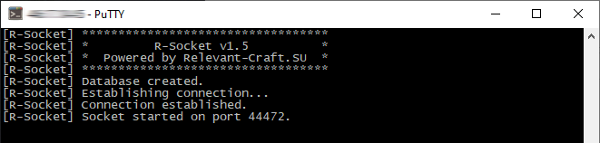

# R-Socket

R-Socket is a server application that accepts requests from [R-Launcher](https://github.com/VENTO-off/R_Launcher) and returns a direct link for downloading requested file from www.curseforge.com.

## Features
- retrieves direct link for downloading file
- bypasses CloudFlare JavaScript challenge
- stores all the data to SQLite database
- accepts commands from command-line interface:
  - *disk* - show amount of stored files in database
  - *halt* - suspend accepting requests to socket
  - *list* - show amount of currently connected users 
  - *mem* - show memory usage
  - *stop* - stop socket and exit from application
  - *wget* - get direct link for downloading

## Technologies
- Java 8
- SQLite

## Screenshots

## License
The launcher is licensed under the GNU General Public License v3.0.
